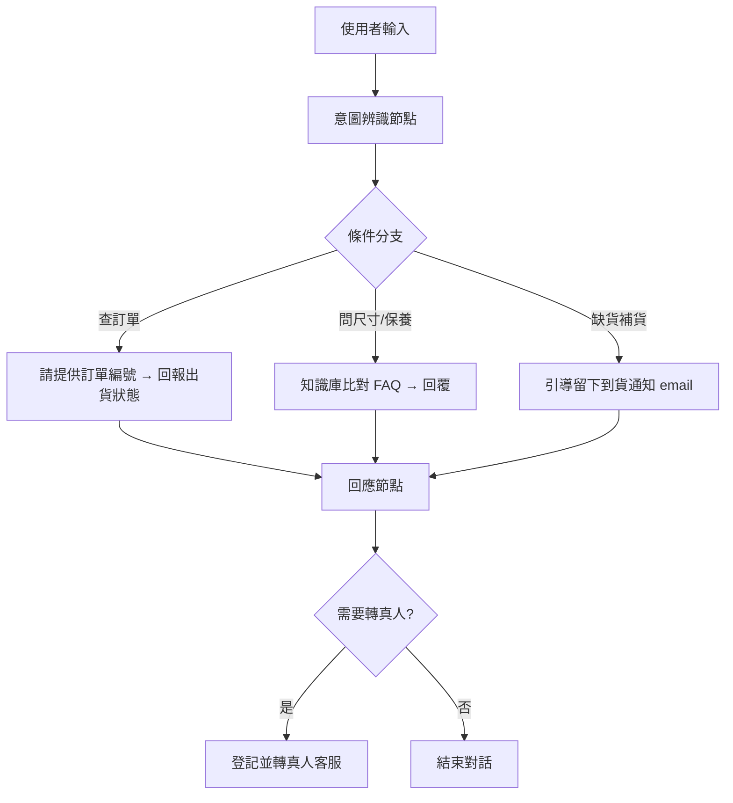

# 產品客服 Agent 學習文件

> **單元 0：拖拉式 AI Agent 導論與 Coze 平台初探**
> 專案主題：Maileg 娃娃專屬 24 小時線上客服助理

---

## 一、應用場景

我認為只要是顧客，都希望能隨時得到即時回覆，但人工客服有上班時間限制，且大量重複性問題（如尺寸、運費、退換貨、出貨進度）會佔用客服人力。

我很喜歡 **Maileg**（丹麥設計的娃娃與玩偶品牌，以老鼠家族、兔子家族及各式娃娃屋家具聞名）的產品，但觀察到目前品牌與多數代理通路的官網**並沒有 AI 客服**，顧客常見的疑問（例如：這隻娃娃多大？可以水洗嗎？我的訂單到哪了？缺貨什麼時候補？）多半只能靠翻 FAQ 頁面或寄 email 等回覆。

因此本 Agent 目標是打造一個 **24 小時線上、專為娃娃類產品服務的客服助理**，能自動回答常見問題、查詢訂單與出貨進度、說明退換貨與清潔保養方式、處理缺貨補貨與預購諮詢，藉此減少人工客服負擔，讓真人客服能專注在較複雜的個案（如商品瑕疵理賠、大量批發訂單）。

### 為什麼特別鎖定「娃娃類」產品？

- 娃娃有複雜的尺寸系統（My、Micro、Mini … 老鼠家族又分 Baby、Little、Big、Mum & Dad），顧客最常搞混。
- 娃娃多為布偶，清潔保養方式（手洗、不可機洗）常被詢問，適合做成標準化回覆。
- 熱門款、季節限定款經常缺貨，補貨與預購的詢問量大且重複性高，最適合交給 Agent 自動回覆。

---

## 二、Agent 初步構想

| 項目 | 內容 |
|---|---|
| **服務對象** | 喜愛娃娃的網路商店消費者（新手家長、收藏者、送禮者） |
| **主要任務** | 回答娃娃常見問題、查詢出貨進度、說明退換貨與清潔保養、處理缺貨補貨與預購諮詢、引導下單 |
| **使用平台** | Coze（拖拉式、無程式碼 Agent 建構平台） |
| **觸發方式** | 使用者在官網對話框輸入問題後自動回應 |
| **回覆語氣** | 親切、溫暖、口語化，符合溫馨童趣；遇到無法處理的個案則主動引導轉真人客服 |
| **處理邊界** | 一律以系統／知識庫資料為準；涉及退款金額、瑕疵理賠等，交由真人客服確認 |

---

## 三、核心名詞與知識結構

- **AI Agent**：能自主感知輸入、進行判斷並執行任務的 AI 應用
- **拖拉式（No-code）**：不需撰寫程式碼，透過拖拉節點就能建立流程
- **Coze**：本單元使用的 Agent 建構平台，可視覺化組裝對話流程
- **Workflow / 節點**：串接「使用者輸入 → 判斷 → 回應」的流程單元
- **知識庫**：預先整理好的 FAQ 與商品資料，讓 Agent 依據內容回答，避免亂答
- **意圖辨識（Intent）**：判斷顧客這句話想問的類別（如：查訂單／問尺寸／問退貨），再導向對應回覆

---

## 四、以 Maileg 娃娃為例常見問答（Agent 知識庫）

以下是我為 Agent 整理的核心知識庫，依三大主題分類。此表可匯入 Coze 的知識庫節點作為回覆依據。

> ⚠️ 政策相關數字（運費、到貨天數、鑑賞期）為示範模板，正式上線前請以 Maileg 官方／店家實際公告為準。

### 4-1　產品尺寸、材質與系列介紹

| 顧客問題（意圖） | Agent 回覆內容（知識庫） |
|---|---|
| Maileg 娃娃有哪些尺寸？ | Maileg 尺寸由小到大為：My（約 4.5 吋／最小，源自丹麥文「Tiny」）、Micro（約 5 吋）、Mini（約 10 吋）、Medium（約 18 吋）、Maxi（約 21 吋）、Mega（約 28 吋）、Mega Maxi（約 38 吋）。提醒您：娃娃只能穿戴對應尺寸的衣服與家具喔！ |
| 老鼠家族怎麼分大小？ | 老鼠家族依家庭角色分：Baby Mouse（約 8 公分）、Little Brother/Sister（約 11 公分）、Big Brother/Sister（約 13 公分）、Mum & Dad（約 16 公分）。同尺寸的衣服可以互相替換穿搭。 |
| 兔子（Rabbit）和邦尼（Bunny）差在哪？ | 最好認的差別在耳朵：Rabbit 耳朵是「立起來」的，所以看起來比較高；Bunny 耳朵是「垂下來」的。兩者尺寸都從最小的 My、Micro 一路到 Size 5。 |
| 為什麼同一款有 My/Micro，又有 Baby/Mouse 兩種標示？ | 2023 年起 Maileg 更新了命名：舊的「My」對應新的「Baby」尺寸家具、舊的「Micro」對應新的「Mouse」尺寸。建議依「您已擁有的娃娃尺寸」來挑選衣服與家具，比較不會買錯。 |
| 娃娃可以擺姿勢嗎？材質是什麼？ | 多數 Maileg 娃娃手腳內含可彎折的鐵絲，能擺出不同姿勢；主體為棉布填充玩偶。彎折時請溫柔操作，避免內部鐵絲折斷。 |

### 4-2　訂單查詢與出貨進度

| 顧客問題（意圖） | Agent 回覆內容（知識庫） |
|---|---|
| 我的訂單出貨了嗎？ | 請提供您的「訂單編號」或「下單 email」，我幫您查詢目前狀態（處理中／已出貨／配送中／已送達）。一般訂單會在付款完成後 1–3 個工作天內出貨。 |
| 下單多久會到？ | **模板**：標準宅配約 3–12 個工作天送達；急件約 1–7 個工作天。實際到貨時間以物流商更新為準，出貨後會寄送含追蹤碼的通知信給您。 |
| 運費怎麼算？有免運嗎？ | **模板**：單筆訂單滿指定金額（例：NT$X）免運，未達門檻酌收運費 NT$Y。海外／離島或大型商品運費另計，結帳頁會顯示最終金額。 |
| 可以改地址／改訂單內容嗎？ | 若訂單「尚未出貨」，可為您協助修改；若「已出貨」則無法更改，需待收件後依退換貨流程處理。請盡快提供訂單編號讓我確認狀態。 |
| 怎麼查追蹤碼？ | 出貨後系統會寄送含物流追蹤碼的 email；您也可以提供訂單編號，我幫您調出目前的物流進度。 |

### 4-3　退換貨與清潔保養

| 顧客問題（意圖） | Agent 回覆內容（知識庫） |
|---|---|
| 娃娃可以水洗嗎？怎麼清潔？ | 建議以「冷水（約 30°C）輕柔手洗」，請勿機洗、勿用力搓揉、勿烘乾，洗後陰乾即可。因手腳內含鐵絲，浸泡與扭擰都要輕柔，避免變形或生鏽。 |
| 娃娃髒了但不想全洗怎麼辦？ | 局部髒污可用微濕的布沾少量中性清潔劑輕拍該處，再用乾布吸乾、陰乾。平時收納請放在乾燥、防塵的環境，或原盒保存。 |
| 我想退貨，可以嗎？ | **模板**：商品於「鑑賞期內（例：收到後 X 天）」且保持全新未使用、附完整包裝與吊牌，可辦理退貨。特價品、客製化或個人化商品恕不退換。請提供訂單編號由專人為您確認。 |
| 收到的娃娃有瑕疵怎麼辦？ | 很抱歉造成困擾！請拍下瑕疵處照片並提供訂單編號，我會為您登記並轉由真人客服協助換貨或退款，優先為您處理。 |
| 想換不同款式／尺寸可以嗎？ | 換貨需商品為全新未使用狀態並在鑑賞期內。若想換的品項有價差或已缺貨，會由專人與您確認補差價或改退款方式。 |

### 4-4　缺貨、補貨與預購諮詢

| 顧客問題（意圖） | Agent 回覆內容（知識庫） |
|---|---|
| 這款缺貨了，什麼時候補？ | 熱門款與季節限定款補貨時間不固定。可以留下您的 email 或加入「到貨通知」，一旦補貨系統會第一時間通知您，就不會錯過囉！ |
| 可以預購嗎？ | **模板**：部分新品／季節款開放預購，商品頁若標示「預購」即可下單，並會註明「預計出貨時間」。預購商品通常會與現貨分開出貨。 |
| 缺貨的款式還會再進嗎？ | 常態款通常會再補貨；季節限定或聯名款則可能售完不再生產。若您告訴我確切品名，我可以幫您確認它屬於哪一類。 |
| 有沒有類似的替代款推薦？ | 當然！請告訴我您想要的尺寸（如 Micro 兔子）或用途（送禮／收藏／幼兒陪伴），我可以推薦目前有現貨的相近款式給您參考。 |

---

## 五、Agent 對話流程設計

我把顧客一句話進來後的處理流程，拆成以下節點，之後在 Coze 用拖拉方式串接：

1. **使用者輸入**：顧客在官網輸入問題。
2. **意圖辨識節點**：判斷問題屬於哪一類——產品尺寸／訂單出貨／退換貨保養／缺貨預購／其他。
3. **條件分支**：依意圖導向對應處理。
   - 查訂單 → 請顧客提供訂單編號 → 回報出貨狀態
   - 問尺寸／保養 → 從知識庫比對 FAQ → 回覆對應答案
   - 缺貨補貨 → 引導留下「到貨通知」email
4. **知識庫查詢節點**：比對第四章整理的 FAQ 內容，取出最相符的回覆。
5. **回應節點**：以親切口語回覆顧客。
6. **轉真人客服判斷**：若為瑕疵理賠、退款金額、超出知識庫範圍的問題，回覆「已為您登記，將由專人協助」並轉單。

> **設計原則**：Agent 只根據知識庫與系統資料回答，避免給錯資訊造成客訴。

---

## 六、本週學習心得

這週學到 AI Agent 不一定要會寫程式也能建立，透過 Coze 的拖拉式介面就能組出一個能對話的客服助理，讓我對無程式碼開發有了一些認識。

實際把主題聚焦在我喜歡的 Maileg 娃娃後，我發現整理知識庫其實比拖節點還關鍵——要先把顧客真正會問的問題（尤其是最容易搞混的尺寸系統、能不能水洗、缺貨補貨）想清楚並分類，Agent 才答得準。這讓我更理解到：客服 Agent 的價值不在技術多厲害，而在背後的內容整理是否貼近顧客需求。

過程中比較不熟悉的是 GitHub 的 Repo 建立，README 上傳流程之前就有處理過，但實際操作一次後我學會了以前不太熟的東西。

---

## 七、本週操作流程紀錄

1. 登入 GitHub，點右上角 **+ → New repository** 建立新 Repo（名稱：`customer-service-agent`，並勾選 Add a README file）
2. 進入 Repo，點 `README.md` 的鉛筆圖示進行編輯
3. 填入 Maileg 娃娃客服 Agent 的應用場景、構想、核心名詞與 FAQ 知識庫
4. 點 **Commit changes** 儲存變更
5. 回到 Repo 首頁，複製網頁連結：<https://github.com/yxxi3uuu/customer-service-agent>
